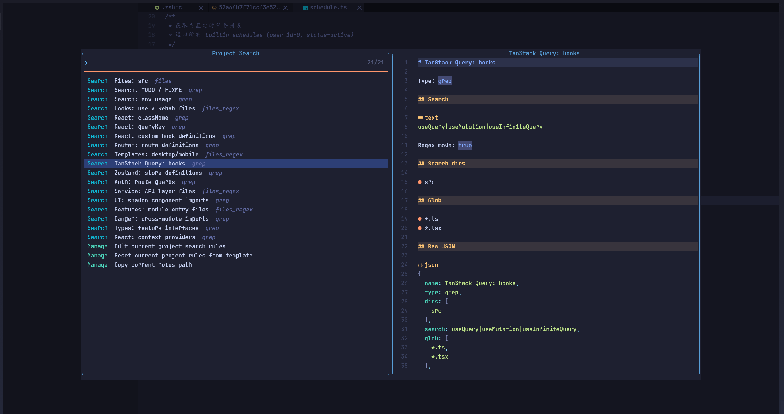
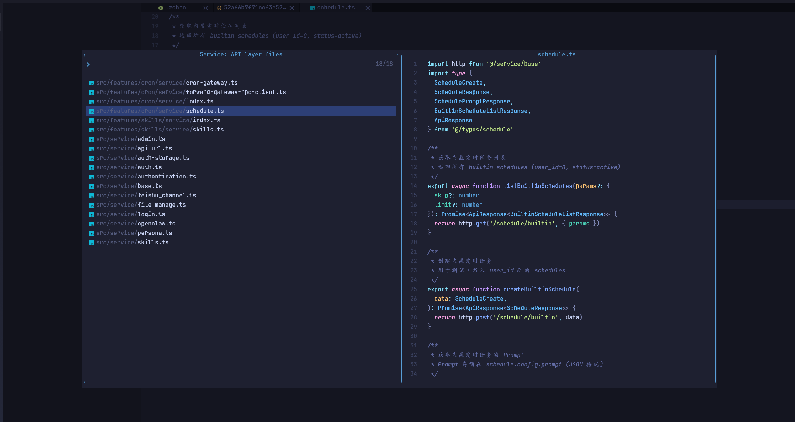

# lazy-project-search.nvim

Project-level search presets for Neovim and LazyVim, powered by Snacks Picker.

[中文文档](README.zh-CN.md)

Status: usable for daily Neovim/LazyVim workflows. The rule format and public API may still change before v1.0.

## Documentation

- [Configuration](docs/configuration.md)
- [Formatting](docs/formatting.md)
- [Validation and tests](docs/validation.md)
- [Changelog](CHANGELOG.md)

## Why

Every real project develops its own search habits.

In a React codebase, you may repeatedly look for:

- route files and route definitions
- TanStack Query hooks and `queryKey`
- service layer files, excluding tests
- feature module entry files
- cross-feature imports
- UI component imports
- TODO/FIXME and environment variable usage

Running ad-hoc grep commands for these patterns works, but the knowledge stays in your head. This plugin turns those project-specific searches into editable JSON presets, then exposes them through one fast picker.

Rules are stored outside your repository:

```text
~/.local/share/nvim/project-search/rules/<project-hash>.json
```

That keeps source trees clean while still letting every project have its own search rules.

## What It Gives You

- Fast normal-mode entry point, recommended as `<C-p>`
- Per-project JSON rule files
- Auto-initialization on first use
- Search rules for `files`, `grep`, and `files_regex`
- Template detection for common, React, Vue, and NestJS projects
- User template directories for personal/team presets
- Rule previews in Snacks Picker
- Cached rule validation by file mtime/size so opening the picker stays fast
- Search presets grouped separately from management actions
- A stable `:ProjectSearch` command with subcommands for edit/reset/validate/reload/templates/health

## React Project Example

The picker below is from a React project with route, TanStack Query, service layer, feature module, and UI import presets. Search rules stay at the top, while rule-management actions are grouped at the bottom.



This example shows a service-directory rule that finds API-layer files while excluding test files:



## Installation With LazyVim

Create `~/.config/nvim/lua/plugins/lazy-project-search.lua`:

```lua
return {
  {
    "CoderLambert/lazy-project-search.nvim",
    main = "project_search",
    dependencies = {
      "folke/snacks.nvim",
    },
    cmd = {
      "ProjectSearch",
    },
    keys = {
      {
        "<C-p>",
        "<cmd>ProjectSearch<cr>",
        desc = "Project Search",
      },
    },
    opts = {
      keymap = false,
      storage_dir = vim.fn.stdpath("data") .. "/project-search/rules",
      auto_init = true,
    },
  },
}
```

Then run:

```vim
:Lazy sync
```

LazyVim users should enable Snacks Picker:

```vim
:LazyExtras
```

Enable:

```text
editor.snacks_picker
```

## Installation With Plain Neovim

LazyVim is not required. You can use this plugin in a regular Neovim setup as long as `snacks.nvim` is installed with picker enabled.

Example with lazy.nvim:

```lua
return {
  {
    "folke/snacks.nvim",
    priority = 1000,
    lazy = false,
    opts = {
      picker = {
        enabled = true,
      },
    },
  },
  {
    "CoderLambert/lazy-project-search.nvim",
    main = "project_search",
    dependencies = {
      "folke/snacks.nvim",
    },
    cmd = {
      "ProjectSearch",
    },
    keys = {
      {
        "<C-p>",
        "<cmd>ProjectSearch<cr>",
        desc = "Project Search",
      },
    },
    opts = {
      keymap = false,
      storage_dir = vim.fn.stdpath("data") .. "/project-search/rules",
      auto_init = true,
      root_markers = {
        ".git",
        "package.json",
        "pnpm-workspace.yaml",
        "lazy-lock.json",
      },
    },
  },
}
```

Without LazyVim, project root detection uses `root_markers`. You can override it completely:

```lua
opts = {
  root = function()
    return vim.fs.root(0, { ".git", "package.json" }) or vim.fn.getcwd()
  end,
}
```

## Keymap Recommendations

The recommended mapping is normal-mode `<C-p>`:

```lua
keys = {
  {
    "<C-p>",
    "<cmd>ProjectSearch<cr>",
    desc = "Project Search",
  },
}
```

Why `<C-p>`:

- Fast single chord for a frequently used project picker.
- Mnemonic for Project Search or Project Picker.
- Avoids LazyVim's common `<leader>p` yank-history mapping.
- Does not affect insert-mode `<C-p>` completion navigation.

Useful alternatives:

| Keymap | When to use |
| --- | --- |
| `<C-p>` | Recommended when normal-mode `<C-p>` is free. |
| `<leader>sP` | Best conflict-free fallback inside LazyVim's search namespace. |
| `<leader>fP` | Good if you prefer grouping project search under file/find commands. |

Avoid `<leader>p` in LazyVim setups because it is commonly used for Yank History. Avoid `<leader><space>` and `<leader>fp` because LazyVim uses them for Find Files and Projects.

## How To Use It In Your Project

1. Open a project in Neovim.
2. Press `<C-p>` or run `:ProjectSearch`.
3. On first use, the plugin creates a JSON rules file for the current project and opens it.
4. Edit the generated presets to match your project conventions.
5. Press `<C-p>` again and run searches from the picker.

The useful workflow is:

- Start from generated common/React/Vue/Nest presets.
- Add rules for project-specific directories such as `features`, `routes`, `service`, `modules`, or `packages`.
- Turn repeated manual searches into named rules.
- Keep rules specific enough to be useful, but broad enough to survive refactors.

Good candidates for custom rules:

| Need | Rule type |
| --- | --- |
| Open a common directory quickly | `files` |
| Search code text such as `queryKey`, `className`, `TODO` | `grep` |
| Find files by path conventions such as `hooks/use-*` | `files_regex` |

## Commands

The recommended command interface uses one stable lazy.nvim entry point:

```vim
:ProjectSearch
:ProjectSearch edit
:ProjectSearch init
:ProjectSearch init!
:ProjectSearch reset
:ProjectSearch path
:ProjectSearch validate
:ProjectSearch reload
:ProjectSearch templates
:ProjectSearch health
:ProjectSearch help
```

Backward-compatible command aliases are still registered after the plugin loads:

```vim
:ProjectSearchEdit
:ProjectSearchInit
:ProjectSearchInit!
:ProjectSearchReset
:ProjectSearchPath
:ProjectSearchValidate
:ProjectSearchReload
:ProjectSearchTemplates
:ProjectSearchHealth
```

`ProjectSearch validate` validates the current project's JSON rules and reports errors/warnings. `ProjectSearch reload` clears the in-memory rules cache and reloads rules from disk.

## Configuration

For the complete configuration reference and rule schema, see [docs/configuration.md](docs/configuration.md).

```lua
require("project_search").setup({
  keymap = "<leader>sP",
  auto_init = true,
  storage_dir = vim.fn.stdpath("data") .. "/project-search/rules",
  template_dirs = {
    vim.fn.stdpath("config") .. "/project-search/templates",
    vim.fn.stdpath("data") .. "/project-search/templates",
  },
  root = nil,
  root_markers = {
    ".git",
    "package.json",
    "pnpm-workspace.yaml",
    "pnpm-lock.yaml",
    "yarn.lock",
    "package-lock.json",
    "lazy-lock.json",
    "stylua.toml",
    "selene.toml",
  },
  default_excludes = {
    ".git",
    "node_modules",
    "dist",
    "build",
    ".next",
    ".nuxt",
    "coverage",
  },
  templates = {
    common = true,
    react = true,
    vue = true,
    nest = true,
    user = {},
  },
  picker = {
    title = "Project Search",
    layout = "default",
  },
})
```

If you use lazy.nvim `keys`, keep `keymap = false` in `opts` to avoid registering the key twice.

## Requirements

- Neovim 0.10+
- `folke/snacks.nvim`
- `ripgrep` for grep presets
- `fd` or `fdfind` for `files_regex` presets

Ubuntu/Linux Mint:

```bash
sudo apt update
sudo apt install -y ripgrep fd-find

mkdir -p ~/.local/bin
ln -sf "$(command -v fdfind)" ~/.local/bin/fd
```

## Rule Types

### files

Use `files` when you want a file picker rooted at a specific project directory.

```json
{
  "id": "common.files.src",
  "name": "Files: src",
  "description": "Open a file picker rooted at src.",
  "type": "files",
  "cwd": "src"
}
```

### grep

Use `grep` when you want to search inside files.

```json
{
  "id": "react.query_key",
  "name": "React: queryKey",
  "description": "Search TanStack Query queryKey usage.",
  "type": "grep",
  "search": "queryKey",
  "dirs": ["src", "app"],
  "glob": ["*.ts", "*.tsx"]
}
```

Regex grep:

```json
{
  "id": "react.query_hooks",
  "name": "TanStack Query: hooks",
  "description": "Search query-related React hooks.",
  "type": "grep",
  "regex": true,
  "search": "useQuery|useMutation|useInfiniteQuery",
  "dirs": ["src"],
  "glob": ["*.ts", "*.tsx"]
}
```

### files_regex

Use `files_regex` when you want to find files by path convention.

`files_regex` is backed by `fd`/`fdfind`, so its regex syntax follows Rust regex rules. Look-around is not supported. Avoid `(?=...)`, `(?!...)`, `(?<=...)`, and `(?<!...)`.

```json
{
  "id": "react.hooks.kebab",
  "name": "Hooks: use-* kebab files",
  "description": "Find hook files such as hooks/use-claw-history-panel.ts.",
  "type": "files_regex",
  "regex": "(^|/)hooks/use-[a-z0-9-]+\\.(ts|tsx|js|jsx)$",
  "dirs": ["src", "app", "packages"],
  "exclude": ["node_modules", "dist", "build", ".next"]
}
```

Use `exclude` for negative file-name filters. For example, to find service layer files but exclude test files:

```json
{
  "id": "project.service_files",
  "name": "Service: API layer files",
  "description": "Find TypeScript files under service directories, excluding test files.",
  "type": "files_regex",
  "regex": "service/[^/]+\\.(ts|tsx)$",
  "dirs": ["src"],
  "exclude": ["*.test.ts", "*.test.tsx", "*.spec.ts", "*.spec.tsx"]
}
```

Do not write that rule with lookbehind, because `fd` will reject it:

```json
{
  "regex": "service/[^/]+(?<!\\.test|\\.spec)\\.(ts|tsx)$"
}
```

If `fd` rejects a regex, Project Search reports the underlying `fd` error instead of silently showing an empty result.

`dirs`, `glob`, `exclude`, and `args` may be written as either a string or a string array. Project Search normalizes string values into arrays before running presets.

## Picker Layout

The main panel keeps executable search rules first and management actions at the bottom:

```text
── Common ──
  Files: src                         files

── React ──
  React: className                   grep

── Service ──
  Service: API layer files           files_regex

── Manage ──
  Edit current project search rules
  Reset current project rules from template
  Validate current project rules
  Reload current project rules
  Copy current rules path
```

Rule previews are generated on demand when the preview pane needs them, so opening the panel stays fast even with many presets.

## Example Rules For A React Project

```json
{
  "version": 1,
  "meta": {
    "projectRoot": "/home/lambert/githubRepos/your-project",
    "template": "react",
    "createdAt": "2026-05-20T00:00:00Z",
    "note": "This file is stored outside your project. Edit presets to customize Project Search."
  },
  "presets": [
    {
      "id": "react.hooks.kebab",
      "name": "Hooks: use-* kebab files",
      "description": "Find hook files such as hooks/use-claw-history-panel.ts.",
      "type": "files_regex",
      "regex": "(^|/)hooks/use-[a-z0-9-]+\\.(ts|tsx|js|jsx)$",
      "dirs": ["src", "app", "packages"]
    },
    {
      "id": "react.query_hooks",
      "name": "TanStack Query: hooks",
      "description": "Search query-related React hooks.",
      "type": "grep",
      "regex": true,
      "search": "useQuery|useMutation|useInfiniteQuery",
      "dirs": ["src"],
      "glob": ["*.ts", "*.tsx"]
    },
    {
      "id": "project.service_files",
      "name": "Service: API layer files",
      "description": "Find TypeScript files under service directories, excluding test files.",
      "type": "files_regex",
      "regex": "service/[^/]+\\.(ts|tsx)$",
      "dirs": ["src"],
      "exclude": ["*.test.ts", "*.test.tsx", "*.spec.ts", "*.spec.tsx"]
    }
  ]
}
```

## Troubleshooting

Run:

```vim
:ProjectSearch health
```

or:

```vim
:checkhealth project_search
```

The health check validates the current project rules when a rules file exists.

Common issues:

| Symptom | Check |
| --- | --- |
| `grep` rules are empty | Make sure `ripgrep` is installed. |
| `files_regex` rules are empty | Make sure `fd`/`fdfind` is installed and the regex is supported by Rust regex. |
| First use opens a JSON file | That is expected. Edit and save the generated project rules, then open the picker again. |
| A keymap does nothing | Check `:verbose nmap <C-p>` and choose a conflict-free key in your lazy.nvim spec. |
